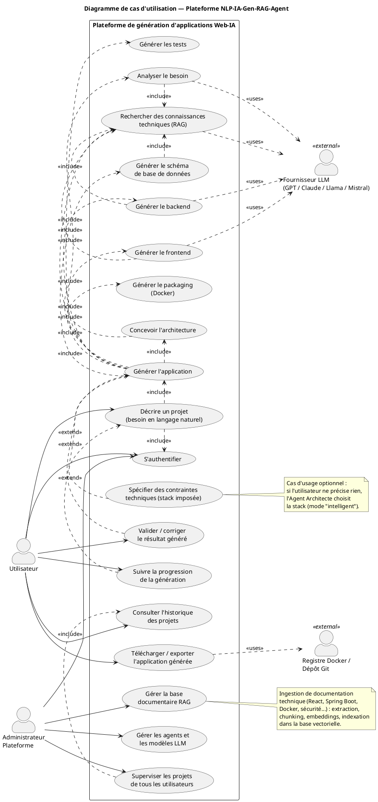
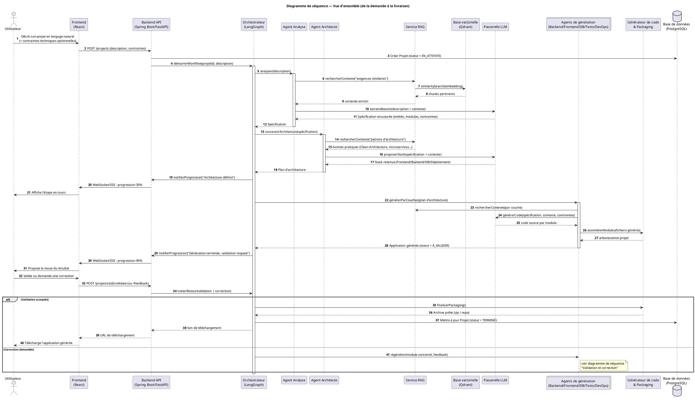
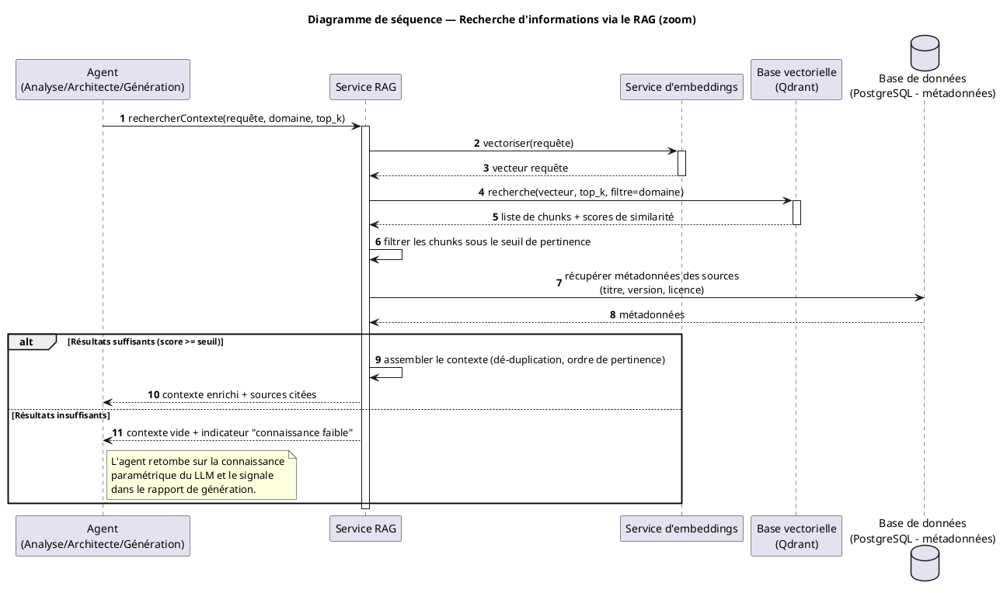
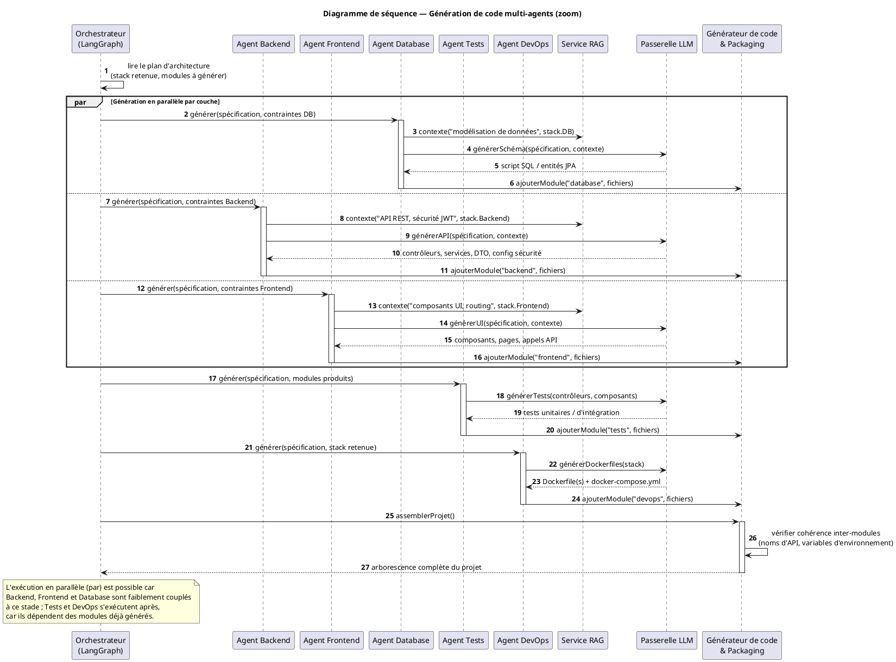
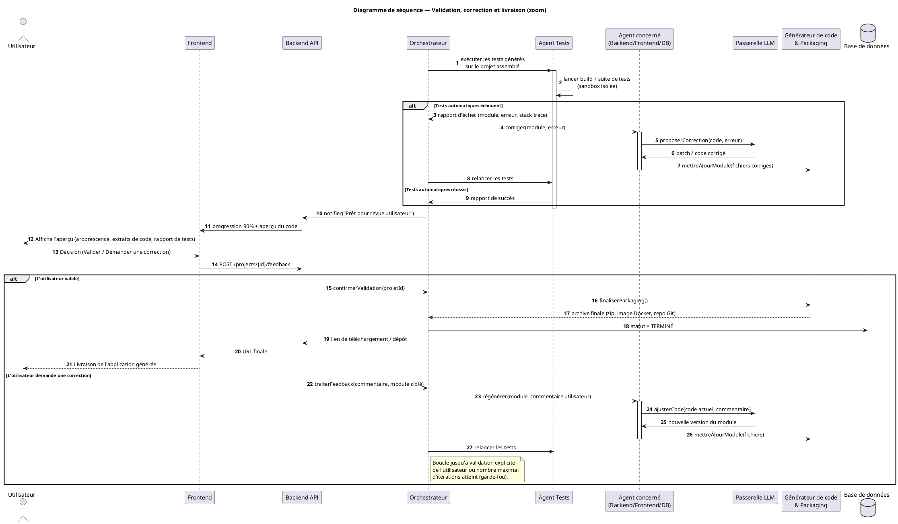
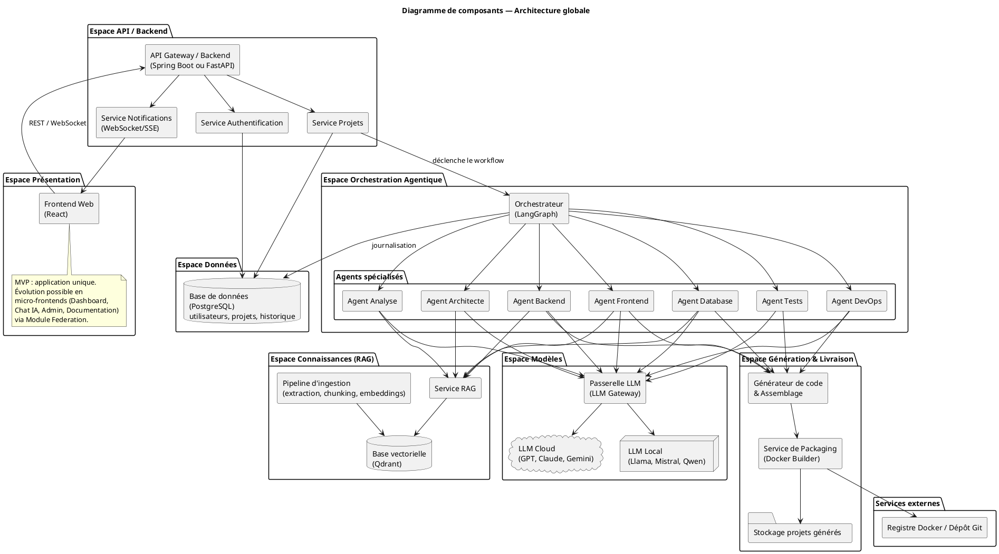
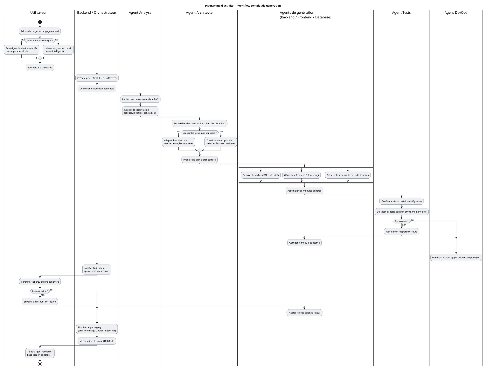

```plantuml
@startuml 06_class_diagram
title Diagramme de classes — Plateforme NLP-IA-Gen-RAG-Agent
skinparam classAttributeIconSize 0
hide empty members

class Utilisateur {
  -id : UUID
  -nom : String
  -email : String
  -motDePasseHash : String
  -role : RoleUtilisateur
  -dateCreation : DateTime
  +authentifier(motDePasse : String) : boolean
}

enum RoleUtilisateur {
  UTILISATEUR
  ADMINISTRATEUR
}

class Projet {
  -id : UUID
  -titre : String
  -descriptionBrute : String
  -statut : StatutProjet
  -modeGeneration : ModeGeneration
  -dateCreation : DateTime
  -dateMiseAJour : DateTime
  +demarrerGeneration() : void
  +mettreAJourStatut(s : StatutProjet) : void
}

enum StatutProjet {
  EN_ATTENTE
  ANALYSE_EN_COURS
  ARCHITECTURE_DEFINIE
  GENERATION_EN_COURS
  A_VALIDER
  EN_CORRECTION
  TERMINE
  ECHEC
}

enum ModeGeneration {
  INTELLIGENT
  PERSONNALISE
}

class Specification {
  -id : UUID
  -typeApplication : String
  -modulesMetier : List<String>
  -entitesIdentifiees : List<String>
  -contraintesFonctionnelles : List<String>
  +versDescriptionStructuree() : Map
}

class ContrainteTechnique {
  -id : UUID
  -frontend : String
  -backend : String
  -baseDeDonnees : String
  -deploiement : String
}

class PlanArchitecture {
  -id : UUID
  -styleArchitectural : String
  -stackRetenue : Map<String, String>
  -justification : String
}

class ApplicationGeneree {
  -id : UUID
  -cheminArchive : String
  -urlDepot : String
  -dateGeneration : DateTime
  +assemblerArchive() : String
}

abstract class ModuleGenere {
  -id : UUID
  -type : TypeModule
  -contenuFichiers : Map<String, String>
  -statutValidation : boolean
  +ajouterFichier(chemin : String, contenu : String) : void
}
enum TypeModule {
  FRONTEND
  BACKEND
  BASE_DE_DONNEES
  TESTS
  DEVOPS
}

class RapportValidation {
  -id : UUID
  -testsReussis : int
  -testsEchoues : int
  -erreurs : List<String>
  -dateExecution : DateTime
}

class Feedback {
  -id : UUID
  -commentaire : String
  -moduleCible : TypeModule
  -dateEnvoi : DateTime
}

class DocumentRAG {
  -id : UUID
  -titre : String
  -source : String
  -domaine : String
  -dateIndexation : DateTime
}

class Chunk {
  -id : UUID
  -contenu : String
  -embedding : float[]
  -numeroSequence : int
}

class HistoriqueExecution {
  -id : UUID
  -etape : String
  -agent : String
  -horodatage : DateTime
  -details : String
}

abstract class Agent {
  -nom : String
  -role : String
  #ragService : RAGService
  #llmService : LLMService
  +executer(entree : Object) : Object
  #construirePrompt(entree : Object, contexte : String) : String
}

class AgentAnalyse extends Agent {
  +analyserBesoin(description : String) : Specification
}
class AgentArchitecte extends Agent {
  +concevoirArchitecture(spec : Specification, contraintes : ContrainteTechnique) : PlanArchitecture
}
class AgentBackend extends Agent {
  +genererAPI(spec : Specification, plan : PlanArchitecture) : ModuleGenere
}
class AgentFrontend extends Agent {
  +genererUI(spec : Specification, plan : PlanArchitecture) : ModuleGenere
}
class AgentDatabase extends Agent {
  +genererSchema(spec : Specification, plan : PlanArchitecture) : ModuleGenere
}
class AgentTests extends Agent {
  +genererTests(modules : List<ModuleGenere>) : ModuleGenere
  +executerTests(projet : Projet) : RapportValidation
}
class AgentDevOps extends Agent {
  +genererDeploiement(plan : PlanArchitecture) : ModuleGenere
}

class Orchestrateur {
  -agentsEnregistres : List<Agent>
  -grapheWorkflow : Object
  +demarrerWorkflow(projet : Projet) : void
  +routerVersAgent(etape : String) : Agent
  +traiterFeedback(feedback : Feedback) : void
}

interface LLMService {
  +completer(prompt : String) : String
  +genererCode(prompt : String, contexte : String) : String
}
class LLMGatewayService implements LLMService {
  -fournisseurActif : String
  -fournisseursDisponibles : List<String>
  +selectionnerFournisseur(criteres : Map) : void
}

interface BaseVectorielle {
  +indexer(chunk : Chunk) : void
  +rechercher(vecteur : float[], topK : int) : List<Chunk>
}
class QdrantAdapter implements BaseVectorielle

class RAGService {
  -baseVectorielle : BaseVectorielle
  -serviceEmbeddings : Object
  +rechercherContexte(requete : String, domaine : String) : String
  +ingererDocument(doc : DocumentRAG) : void
}

class CodeGeneratorService {
  +assemblerModules(modules : List<ModuleGenere>) : ApplicationGeneree
  +verifierCoherence(modules : List<ModuleGenere>) : boolean
}

class PackagingService {
  +construireArchive(app : ApplicationGeneree) : String
  +publierSurDepot(app : ApplicationGeneree) : String
}

class ProjectService {
  +creerProjet(u : Utilisateur, description : String) : Projet
  +obtenirStatut(projetId : UUID) : StatutProjet
}

class AuthService {
  +connecter(email : String, motDePasse : String) : String
  +verifierJeton(jeton : String) : Utilisateur
}

Utilisateur "1" -- "0..*" Projet : soumet >
Projet "1" *-- "1" Specification
Projet "0..1" *-- "0..1" ContrainteTechnique
Projet "1" *-- "0..1" PlanArchitecture
Projet "1" *-- "0..1" ApplicationGeneree
Projet "1" -- "0..*" HistoriqueExecution
Projet "1" -- "0..*" Feedback
ApplicationGeneree "1" o-- "1..*" ModuleGenere
ModuleGenere "1" -- "0..*" RapportValidation

Orchestrateur "1" o-- "1..*" Agent : coordonne >
Agent --> LLMService : utilise >
Agent --> RAGService : utilise >
RAGService --> BaseVectorielle : interroge >
RAGService "1" -- "0..*" DocumentRAG
DocumentRAG "1" *-- "1..*" Chunk

ProjectService --> Orchestrateur : déclenche >
ProjectService --> Projet
AuthService --> Utilisateur
CodeGeneratorService --> ModuleGenere
PackagingService --> ApplicationGeneree

@enduml
```

# Conception UML — Sujet 21 : NLP-IA-Gen-RAG-Agent

*Plateforme de création automatisée d'applications Web-IA — Architecture modulaire et composable*

---

## 1. Analyse du système

### 1.1 Objectif principal

La plateforme permet à un utilisateur de **décrire en langage naturel** l'application web qu'il souhaite obtenir (avec ou sans contraintes techniques imposées), puis de **générer automatiquement** cette application — frontend, backend, base de données, authentification, tests, Docker, documentation — grâce à une **équipe d'agents IA spécialisés**, orchestrés (LangGraph), qui s'appuient sur un **LLM** pour comprendre/générer et sur un **RAG** pour ancrer leurs décisions dans une base documentaire technique (Spring Boot, React, sécurité, Docker, architecture logicielle...).

Deux modes d'usage, tous deux issus du document source :
- **Mode intelligent** : l'utilisateur ne précise pas la stack → les agents la choisissent selon les bonnes pratiques et le RAG.
- **Mode personnalisé** : l'utilisateur impose une stack (ex. React + Laravel + MySQL) → les agents doivent la respecter.

### 1.2 Acteurs du système

| Acteur | Nature | Rôle |
|---|---|---|
| **Utilisateur** | Humain, principal | Décrit son besoin, suit la génération, valide/corrige, télécharge le résultat |
| **Administrateur** | Humain | Gère la base RAG (documents), les agents, les modèles LLM disponibles, supervise tous les projets |
| **Fournisseur LLM** (GPT, Claude, Llama, Mistral...) | Système externe | Répond aux requêtes de complétion/génération envoyées par la passerelle LLM |
| **Registre Docker / Dépôt Git** | Système externe | Reçoit l'application packagée en fin de chaîne |

### 1.3 Fonctionnalités principales

- S'authentifier
- Décrire un projet en langage naturel, avec ou sans contraintes techniques
- Suivre la progression de la génération en temps réel
- Analyser le besoin, concevoir l'architecture, générer backend/frontend/base de données/tests/déploiement (fonctions internes au système, exposées comme sous-cas d'utilisation)
- Valider ou corriger le résultat généré (boucle de rétroaction)
- Télécharger/exporter l'application générée
- Consulter l'historique de ses projets
- (Admin) Gérer la base documentaire RAG, les agents et les modèles LLM

### 1.4 Composants logiciels nécessaires

1. **Frontend Web** (React) : formulaire de description, dashboard de suivi, aperçu du code, téléchargement.
2. **Backend API** (Spring Boot ou FastAPI) : passerelle REST/WebSocket, authentification, gestion des projets.
3. **Orchestrateur d'agents** (LangGraph) : pilote le graphe d'exécution des agents.
4. **Agents spécialisés** : Analyse, Architecte, Backend, Frontend, Database, Tests, DevOps.
5. **Service RAG** : recherche de contexte technique pertinent.
6. **Base vectorielle** (Qdrant) : stockage des embeddings de la documentation technique.
7. **Passerelle LLM** : abstraction multi-fournisseurs (local : Llama/Mistral/Qwen ; cloud : GPT/Claude/Gemini).
8. **Générateur de code & Packaging** : assemble les modules générés, vérifie la cohérence, construit l'archive/l'image Docker.
9. **Base de données relationnelle** (PostgreSQL) : utilisateurs, projets, historique, feedbacks.
10. **Pipeline d'ingestion RAG** : extraction → chunking → embeddings → indexation des documents techniques.

### 1.5 Interactions entre composants (vue d'ensemble)

```
Utilisateur → Frontend → Backend API → Orchestrateur (LangGraph)
                                            │
                     ┌──────────────────────┼──────────────────────┐
                Agent Analyse        Agent Architecte      Agents de génération
                     │                      │              (Backend/Frontend/DB/Tests/DevOps)
                     └──────────────┬───────┴──────────────────────┘
                                    │                 │
                              Service RAG ──── Base vectorielle (Qdrant)
                                    │
                            Passerelle LLM ──── LLM local / cloud
                                    │
                    Générateur de code & Packaging → Stockage / Dépôt Git
```

Ce document détaille, pour chaque diagramme demandé, son rôle, le code PlantUML correspondant (prêt à générer) et la justification des choix de conception. Les fichiers `.puml` correspondants sont fournis séparément pour édition/rendu direct (VS Code + extension PlantUML, ou plantuml.com).

---

## 2.A Diagramme de cas d'utilisation

### Rôle
Ce diagramme délimite le périmètre fonctionnel de la plateforme : qui interagit avec le système (acteurs) et pour quoi faire (cas d'utilisation), en explicitant les dépendances `include` (sous-fonction systématiquement exécutée) et `extend` (comportement optionnel/conditionnel).

### Points clés de conception
- **`<<include>>`** relie `Générer l'application` à ses sept sous-étapes obligatoires (Analyser, Concevoir, Générer Backend/Frontend/DB/Tests/DevOps) : elles s'exécutent systématiquement, dans cet ordre logique.
- **`<<extend>>`** relie `Spécifier des contraintes techniques` à `Décrire un projet` : c'est optionnel (mode personnalisé vs intelligent), conformément au document source.
- Les cas d'utilisation internes (Analyser, Concevoir, Générer...) incluent tous `Rechercher des connaissances techniques (RAG)` : c'est la spécificité du sujet — aucune génération ne se fait "à l'aveugle".
- L'**Administrateur** est un acteur distinct car il gère l'infrastructure (RAG, agents, LLM) et non le contenu métier des projets — séparation des responsabilités classique en conception SaaS.

### Code PlantUML



---

## 2.B Diagrammes de séquence

Plutôt qu'un unique diagramme monolithique, quatre diagrammes complémentaires sont proposés : une **vue d'ensemble** du parcours complet (répond à l'ensemble des 6 scénarios demandés), puis **trois zooms** sur les étapes les plus riches (RAG, génération multi-agents, validation/correction) — c'est l'approche la plus lisible et la plus réaliste pour un rapport de PFE.

### B.1 Vue d'ensemble (de la demande à la livraison)

**Rôle** : montrer la chronologie complète — description utilisateur → analyse → architecture → génération → validation → livraison — et la façon dont l'orchestrateur active chaque agent.

**Choix de conception** : l'orchestrateur reste le seul point de contact entre le backend et les agents (façade), ce qui garde le backend API indépendant de la logique agentique interne — un agent peut être ajouté/retiré sans toucher à l'API.



### B.2 Zoom — Recherche d'informations via le RAG

**Rôle** : détailler comment un agent obtient un contexte technique fiable avant de solliciter le LLM — cœur de la valeur ajoutée « RAG » du sujet.

**Choix de conception** : un seuil de pertinence (`score >= seuil`) est explicitement modélisé, avec un chemin alternatif si le RAG ne trouve rien de pertinent — évite qu'un agent bloque totalement faute de documentation, tout en traçant clairement quand la génération repose sur la seule connaissance du LLM (traçabilité/qualité).



### B.3 Zoom — Génération de code multi-agents

**Rôle** : détailler l'analyse du besoin (implicite en amont) puis la génération proprement dite, en montrant le **parallélisme** entre agents faiblement couplés.

**Choix de conception** : Backend, Frontend et Database sont générés **en parallèle** (bloc `par`) car ils dépendent tous du même plan d'architecture mais pas les uns des autres à ce stade ; Tests et DevOps sont **séquentiels après**, car ils ont besoin des modules déjà produits (tester du code qui n'existe pas encore n'a pas de sens). C'est un choix réaliste pour un MVP de PFE : facile à paralléliser sans synchronisation complexe.



### B.4 Zoom — Validation, correction et livraison

**Rôle** : modéliser la double boucle de contrôle qualité : une boucle **automatique** (tests générés, exécutés en sandbox) puis une boucle **humaine** (revue et feedback de l'utilisateur), avant packaging final.

**Choix de conception** : deux `alt` imbriqués distinguent clairement l'échec/succès des tests automatiques de la décision finale de l'utilisateur — ce sont deux mécanismes de correction différents (un bug détecté par les tests n'est pas la même chose qu'un changement demandé par l'utilisateur). Un garde-fou (nombre max d'itérations) est mentionné pour éviter une boucle infinie — point important à anticiper pour un vrai projet.



---

## 2.C Diagramme de classes

### Rôle
Modéliser la structure statique du système : entités métier persistées (Projet, Spécification, Application générée...), la hiérarchie des agents, et les services applicatifs qui orchestrent le tout.

### Choix de conception
- **`Agent` est une classe abstraite** dont héritent les sept agents spécialisés : factorise `executer()`, l'accès à `RAGService`/`LLMService`, et la construction de prompt — chaque agent ne redéfinit que sa logique propre. C'est la structure la plus extensible : ajouter un « Agent Sécurité » ou « Agent Documentation » demain ne touche à rien d'existant.
- **`LLMService` et `BaseVectorielle` sont des interfaces** implémentées respectivement par `LLMGatewayService` (qui bascule entre GPT/Claude/Llama/Mistral) et `QdrantAdapter` — cela permet de changer de fournisseur LLM ou de base vectorielle (Qdrant → FAISS/Chroma) sans impacter les agents : principe d'inversion de dépendance, indispensable vu que le sujet cite plusieurs LLM et bases vectorielles possibles.
- **`ApplicationGeneree` agrège plusieurs `ModuleGenere`** (Frontend/Backend/DB/Tests/DevOps) : reflète directement la « décomposition en modules indépendants » demandée dans le sujet, et prépare naturellement l'évolution vers microservices/micro-frontends (chaque `ModuleGenere` peut devenir un dépôt/déploiement séparé).
- **`Orchestrateur` ne contient pas la logique métier des agents** : il les enregistre et les route (`routerVersAgent`), gardant le couplage faible entre orchestration et exécution.

### Code PlantUML



---

## 2.D Diagramme de composants

### Rôle
Donner la vue architecturale globale (déploiement logique) : quels grands blocs composent le système et comment ils communiquent — c'est le diagramme le plus proche de ce qu'on présente à un encadrant pour valider une architecture technique.

### Choix de conception
- Le frontend est présenté comme **une seule application React** pour le MVP, avec une note explicite indiquant l'évolution vers des **micro-frontends** (Dashboard, Chat IA, Administration, Documentation) via Module Federation — cohérent avec la nuance du sujet et avec l'état de l'art (fragmenter uniquement si la complexité le justifie).
- Les **agents spécialisés** sont regroupés visuellement dans l'espace « Orchestration Agentique », séparés de l'espace « Connaissances (RAG) » et de l'espace « Modèles » : trois responsabilités distinctes qui pourraient devenir trois microservices différents si le besoin de scalabilité l'exige (ex. le RAG et le LLM sont plus gourmands en ressources que l'orchestration).
- La **Passerelle LLM** est un composant à part entière (pas juste un détail des agents), car le sujet mentionne explicitement plusieurs LLM interchangeables (local/cloud) : elle isole ce choix du reste du système.
- Le **Service de Packaging** est séparé du **Générateur de code** : le premier construit l'archive/l'image Docker, le second assemble et vérifie la cohérence du code — deux responsabilités différentes qu'il est utile de pouvoir faire évoluer indépendamment (ex. ajouter un registre d'images plus tard).

### Code PlantUML



---

## 2.E Diagramme d'activité

### Rôle
Représenter le **workflow complet**, avec ses points de décision (mode intelligent/personnalisé, tests réussis/échoués, validation utilisateur), sous forme de couloirs (swimlanes) par responsable — utile pour expliquer le fonctionnement à un non-technicien (encadrant, jury).

### Choix de conception
- Le **fork/join** sur Backend/Frontend/Database reflète le même choix de parallélisme que le diagramme de séquence B.3, pour rester cohérent entre les vues.
- Deux boucles de correction distinctes sont représentées : l'une pilotée par les **tests automatiques** (couloir Agent Tests), l'autre par la **décision utilisateur** (couloir Utilisateur) — elles bouclent vers les agents de génération mais ne sont pas déclenchées par les mêmes événements, ce qui est fidèle à la réalité d'un tel système.
- Les couloirs (`|Nom|`) correspondent aux composants/rôles du diagramme de composants (Utilisateur, Backend/Orchestrateur, Agent Analyse, Agent Architecte, Agents de génération, Agent Tests, Agent DevOps) : la cohérence entre diagrammes facilite la lecture croisée du dossier de conception.

### Code PlantUML



---

## 3. Synthèse des choix d'architecture (réalisme PFE)

Pour rester réalisable en stage/PFE, cette conception fait des choix volontairement pragmatiques :

- **Un seul backend modulaire pour le MVP**, pas des microservices dès le départ : les couches (Auth, Projets, Orchestration) sont séparées en *services* internes bien délimités (voir diagramme de classes/composants), ce qui permet d'extraire un microservice plus tard (ex. `Service RAG` ou `Passerelle LLM`) sans tout réécrire — exactement l'esprit de la nuance du sujet ("éventuellement... pour les orchestrations qui n'ont pas de latence critique").
- **Génération en parallèle limitée à 3 agents** (Backend/Frontend/Database) plutôt qu'un parallélisme total : plus simple à déboguer pour un projet solo/binôme, tout en démontrant la capacité multi-agent.
- **Une boucle de correction bornée** (garde-fou sur le nombre d'itérations) : évite un piège classique des systèmes multi-agents non supervisés (taux d'échec élevé documenté dans la littérature) — un point que tu pourras valoriser dans ta soutenance.
- **Interfaces (`LLMService`, `BaseVectorielle`) dès la conception** : coût de conception quasi nul, mais qui te fait gagner beaucoup de temps si tu changes de LLM ou de base vectorielle en cours de stage (fréquent).

---

*Fichiers `.puml` fournis séparément (un par diagramme), plus les images `.png` de prévisualisation générées automatiquement, pour vérification rapide sans avoir à les compiler toi-même.*
